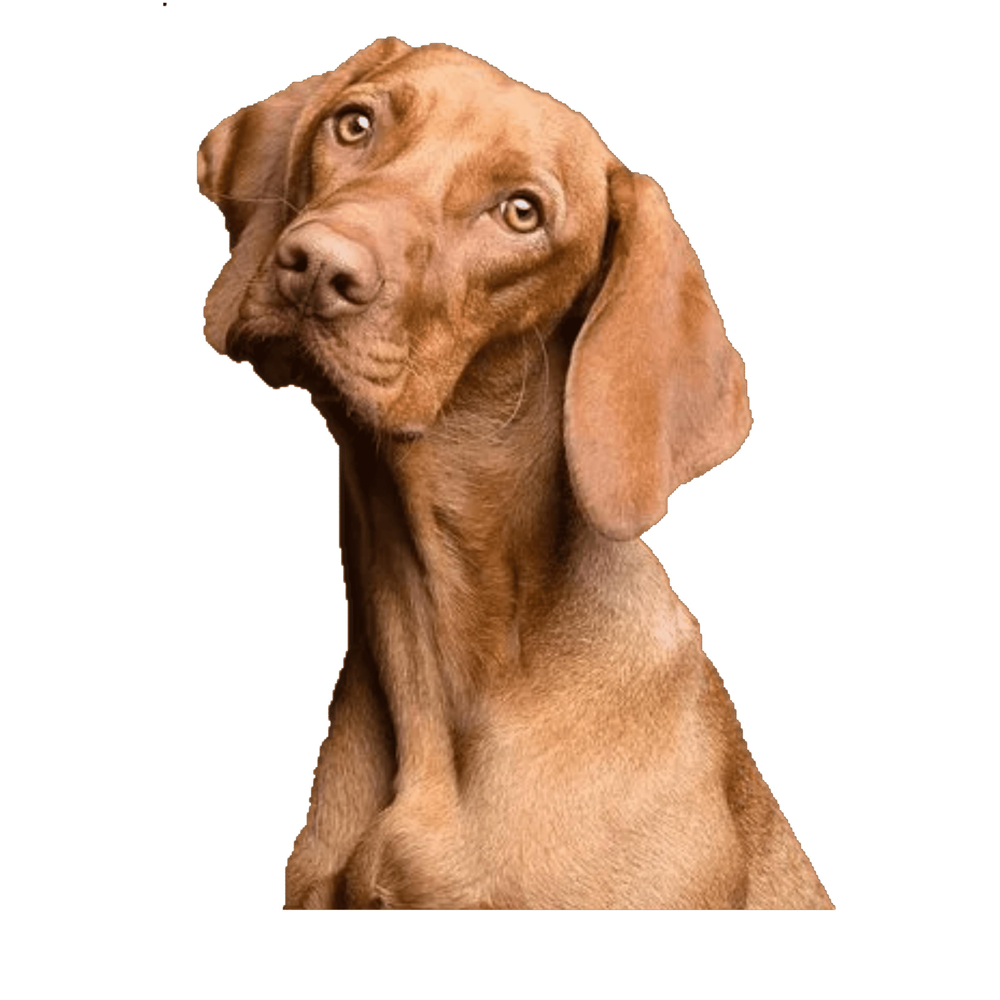
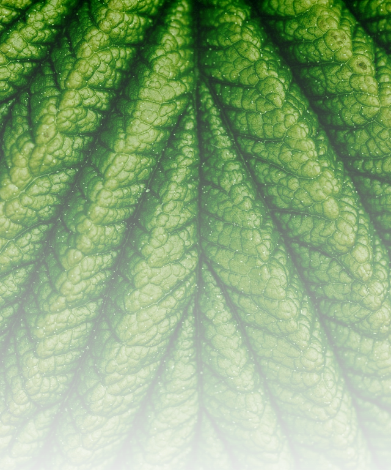

# Inko - Custom Text and Exif Data Overlay on Images

**Version**: 1.0

```
java -jar target/InkoCli-1.0-SNAPSHOT.jar -p data/fg.jpg -t "Life is like a box of chocolates. You never know what you're gonna get." -f "z003" -bg "#80FFFFFF" -po c -fs 35 -o data/output/fgo -sh
```

## Prerequisites

Inko is a Java program that can be built using Maven, a popular build automation and project management tool. Follow the steps below to compile your Java code, package it into a JAR file, and build your project using Maven.

- Java Development Kit (JDK)
- Maven
  
## Description

Inko is a command-line tool that allows you to add custom text or Exif (Exchangeable Image File Format) data to an image. You can use it to annotate your images with various information or labels. Can be used as converter for `JPG` and `PNG` format

## Usage

```
java -jar Inko.jar [OPTIONS]
```

## Options

### File 

- `-p, --imagePath PATH`  
  Specify the path to the input image.

- `-o, --output PATH`  
  Specify the output path and file name (without extension) for the overlaid image. (Default: OverlayedImage)

- `-of, --outputformat FORMAT`  
  Specify the output image format (jpeg, png, gif). (Default: jpeg)

- `-sh, --show`  
  Show the overlaid image after processing.

  ## Overlay data specification

  `-t, --text TEXT`  
  Specify text to overlay on the image. You can use this option multiple times to add multiple text.

- `-d, --date`  
  Get the date of the image from EXIF.

- `-df, --dateformat FORMAT`  
  Set the format of the date.

- `-gmt, --gmt OFFSET`  
  Set the GMT (Greenwich Mean Time) offset.

- `-cm, --cam_model`  
  Get the model of the camera that took the image from EXIF.
- `-cm, --cammodel`  
  Get the model of the camera that took the image.

- `-gps, --gps_location`  
  Get the GPS location of the image from EXIF.
- `-gps, --gpslocation`  
  Get the GPS location of the image.

- `-is, --imagesize`  
  Get the size of the image in pixels from EXIF.

- `-s, --sep SEPARATOR`  
  Specify the separator for data when adding Exif values.


## Overlay format

- `-f, --font FONT`  
  Specify the font to be used for text overlay. (Default: Arial)

- `-fw, --fontwidth WIDTH`  
  Specify the font width (bold, italic, plain). (Default: bold)

- `-fs, --fontSize SIZE`  
  Specify the font size in pixels. (Default: 50)

- `-fc, --fontcolor COLOR`  
  Specify the font color in the format #AARRGGBB (e.g., #ff2e00ff).
  Specify the font color in the format #AARRGGBB (e.g., #ff2e00ff).

- `-bg, --backgroundcolor COLOR`  
  Specify the background color in the format #AARRGGBB.

- `-po, --position POSITION`  
  Specify the position of the overlaid text. Options include l, r, b, t, c, lt, rt, lb, rb. (Default: rb)

- `-m, --margin MARGIN`  
  Specify the margin of the overlaid text (default: 10)

## Other options

- `-cr, --credits`  
  Show program credits.

- `-h, --help`  
  Show program help and description.

## Examples


1. Overlay text on an image:
   ```
   java -jar target/InkoCli-1.0-SNAPSHOT.jar -p data/img.jpg -t "What does the cow say ?" -po c -fc "#FFFF0000" -fs 150 -bg "#80FFFF00" -o output.jpg -sh
   ```
   this commande launch `target/InkoCli-1.0-SNAPSHOT.jar`, get `data/img.jpg`, and apply a textual `-t "What does the cow say ?"` at the center of the image `-po c` with à red font color opacity 100% `-fc "#FFFF0000"` and size 150px `-fs 150`  with a yellow background opacity 50% `"#80FFFF00"`. The output file name is output.jpg `-o output.jpg` and the image will pop up after the process `-sh`

2. Show program credits:
   ```
   java -jar target/InkoCli-1.0-SNAPSHOT.jar -cr
   ```

3. Overlay the date on an image:
   ```
   java -jar target/InkoCli-1.0-SNAPSHOT.jar -p data/img.jpg -d -bg "#80FFFFFF" -o output.jpg -sh
   ```

4. Get the camera model,  GPS location (if contained in EXIF data) and the image size included personal texts:
   ```
   java -jar target/InkoCli-1.0-SNAPSHOT.jar -p data/img.jpg -t "Camera: " -cm -t "GPS : " -gps -is -bg "#80FFFFFF" -o output.jpg -sh
   ```
5. Convert `JPG` to `PNG`
   ```
   java -jar target/InkoCli-1.0-SNAPSHOT.jar -p data/noBackgroud.png -o data/output/backgroud -of jpeg
   ```
   |befor|after|
   |:---:|:---:|
   ||
6. Remove semi transparent backgroung  from `PNG` to `PNG`
   ```
   java -jar target/InkoCli-1.0-SNAPSHOT.jar -p data/semiTransparent.png -o data/output/noTransparency -of jpeg
   ```
   |befor|after|
   |:---:|:---:|
   ||


# Dependencies
## metadata-extractor:
Metadata-Extractor is a Java library for reading metadata from media files.
[https://github.com/drewnoakes/metadata-extractor](https://github.com/drewnoakes/metadata-extractor)

## Picocli
Picocli aims to be the easiest way to create rich command line applications that can run on and off the JVM : [https://github.com/remkop/picocli](https://github.com/remkop/picocli)

*Documentation on [https://picocli.info/](https://picocli.info/)*
